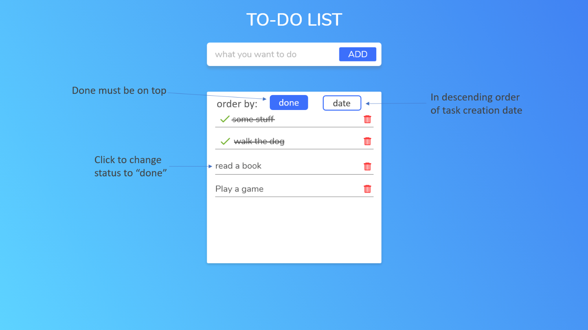

# Pricing component

## Welcome! 👋

Thanks for checking out the Matchely front-end coding challenge.

**To do this challenge, you need a basic understanding of HTML, CSS, JavaScript/Typescript and Angular.**

## The challenge

Your challenge is to build out this pricing component and get it looking as close to the design as possible.

You can use any tools you like to help you complete the challenge. 

Your users should be able to (Basic Design):

- Add, list and remove tasks
- **Bonus**: Complete the challenge with Flexbox and/or Grid
- **Bonus**: Use Angular Material

- **Bonus**: Complete the Bonus Design

## Where to find everything

Your task is to build out the project to the design inside the `/design` folder. 

The design is in static format. This will mean that you'll need to use your best judgment for styles such as `font-size`, `color`, `padding` and `margin`. This should help train your eye to perceive differences in spacings and sizes.

## Building your project

1. Create a new (free) Firebase project.
2. Create a Cloud Firestore Database for the project.
3. Create a Collection where tasks will be saved.
4. Go to the project config page and copy the firebaseConfig info.

5. Below are two suggested process. Feel free to use any workflow that you feel comfortable with:

## First Suggestion (creating the application from scratch)

https://blog.logrocket.com/creating-a-crud-firebase-documents-in-angular/

Initialize your project as a public repository on [GitHub](https://github.com/), then Share the link when you finish the Challenge. 

## Second Suggestion (using Stackblitz)

https://stackblitz.com/edit/angular-fire-start 

Create a Fork, edit what you need, then Share the link to the fork you created

